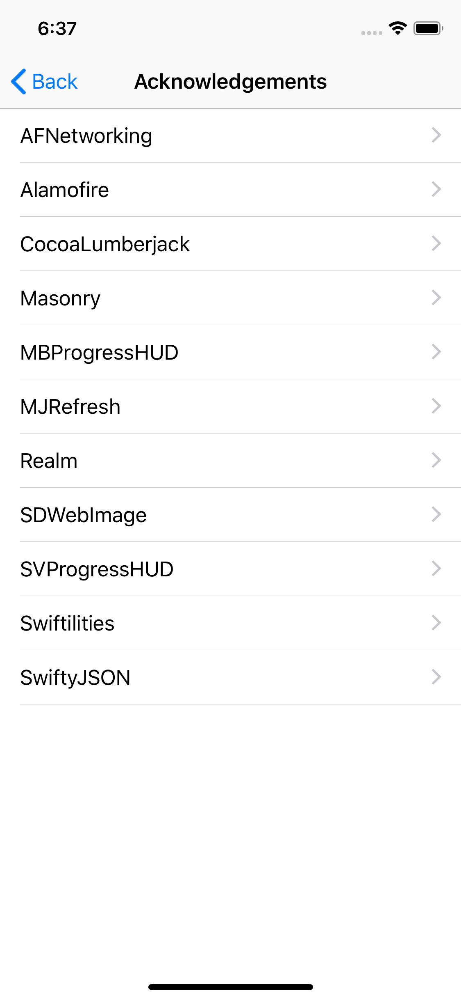
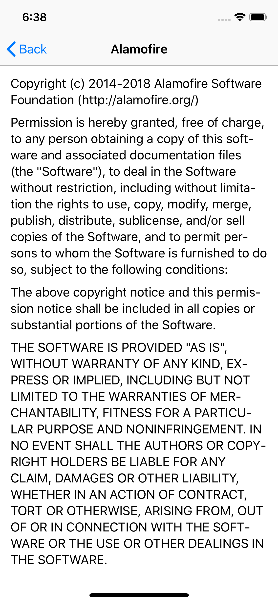
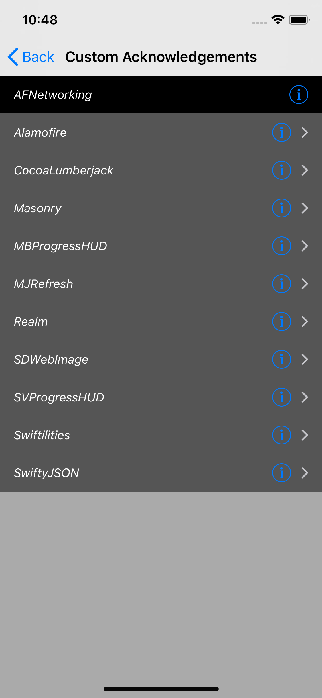
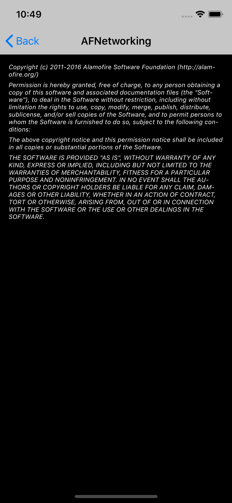

# Acknowledgements

An all-in-one solution for adding an acknowledgement section to your app.

## Screenshots

### Default

<p>



</p>

### Custom

<p>



</p>

## How To

### Default

To use the existing `AcknowledgementsListViewController` as-is, you'll want to do these 4 steps:

1. Add `post_install` hook to your `Podfile` to copy the generated `plist`.
2. Create an instance of `AcknowledgementsListViewModel`. Requires a `try` to catch any `throw`.
3. Create an instance of `AcknowledgementsListViewController` using your view model.
4. Push your view controller onto your existing  `UINavigationController` to take advantage of the built-in back button.


`insert how to`

If you do not plan on subclassing `listviewcontroller` and `viewcontroller`, you must

To use as-is, you must present `listviewcontroller` inside a `navigationcontroller`

[Using Cocoapods generated plist](https://github.com/CocoaPods/CocoaPods/wiki/Acknowledgements)

`insert code sample`

## Code sample

### Default

#### Podfile

```ruby
post_install do | installer |
    require 'fileutils'
    FileUtils.cp_r('Pods/Target Support Files/Pods-<project-name>/Pods-<project-name>.plist', '<project-name>/Acknowledgements.plist', :remove_destination => true)
end
```
This `post_install` hook copies the generated `plist` into your project root folder. _Rememeber to replace `<project-name>` with your project's name_

#### Swift

```swift
do {
  let viewModel = try AcknowledgementsListViewModel()
  let viewController = AcknowledgementsListViewController(viewModel: viewModel)
  navigationController?.pushViewController(viewController, animated: true)  
catch {
  print(error.localizedDescription)
}
```

[Screenshots courtesy of AcknowledgementSample](https://github.com/pauluhn/AcknowledgementSample)
