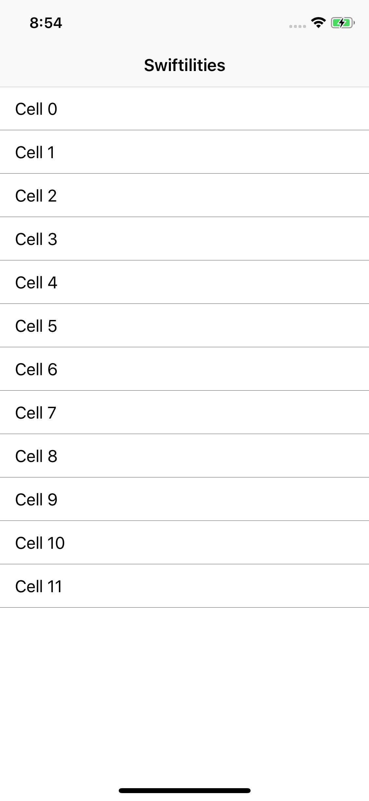

# HairlineView

A `UIView` that has an intrinsic size in one axis (thickness) and is freely resizable in the other. `HairlineView` has a fixed axis, line thickness, and color.


## Default Appearance

<details>
<summary>Screenshots</summary>



</details>

### Quick Start

A simple 1 pixel, horizontal, dark gray hairline:
```swift
let hairline = HairlineView()
cell.contentView.addSubview(hairline)
hairline.translatesAutoresizingMaskIntoConstraints = false
hairline.leadingAnchor.constraint(equalTo: cell.contentView.leadingAnchor).isActive = true
hairline.trailingAnchor.constraint(equalTo: cell.contentView.trailingAnchor).isActive = true
hairline.bottomAnchor.constraint(equalTo: cell.contentView.bottomAnchor).isActive = true
```

## Custom Appearance

<details>
<summary>Screenshots</summary>


</details>

To customize, add init parameters for axis, thickness and color.

```swift
let hairline = HairlineView(axis: .vertical, thickness: 3.0, hairlineColor: .red)
view.addSubview(hairline)
hairline.translatesAutoresizingMaskIntoConstraints = false
hairline.heightAnchor.constraint(equalToConstant: 12.0).isActive = true
hairline.centerYAnchor.constraint(equalTo: button.centerYAnchor).isActive = true
hairline.leadingAnchor.constraint(equalTo: button.trailingAnchor, constant: 20).isActive = true
```
