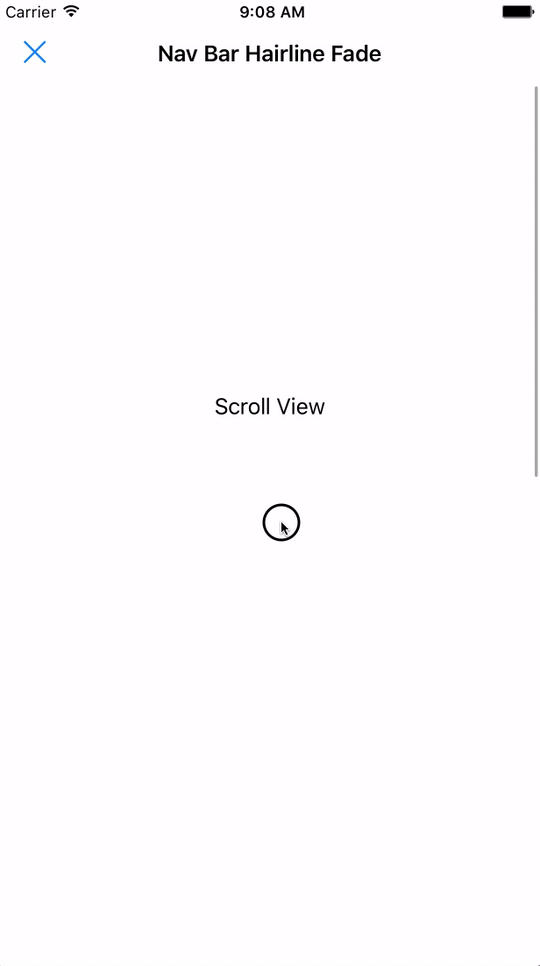

# NavBarHarilineFadeBehavior

This behavior adds a hairline to the bottom of a `UINavigationBar` and animates its `alpha` alongside a `UIScrollView`'s `contentOffset`



## Usage
```swift
override func viewDidLoad() {
  super.viewDidLoad()
  
  let behavior = NavBarHarilineFadeBehavior(scrollView: scrollView)
  
  //optional configuration  
  behavior.contentOffsetFadeRange = 0...100
  behavior.hairlineColor = .lightGray
  behavior.hairlineThickenss = 1
  
  addBehaviors([behavior])
}
```
