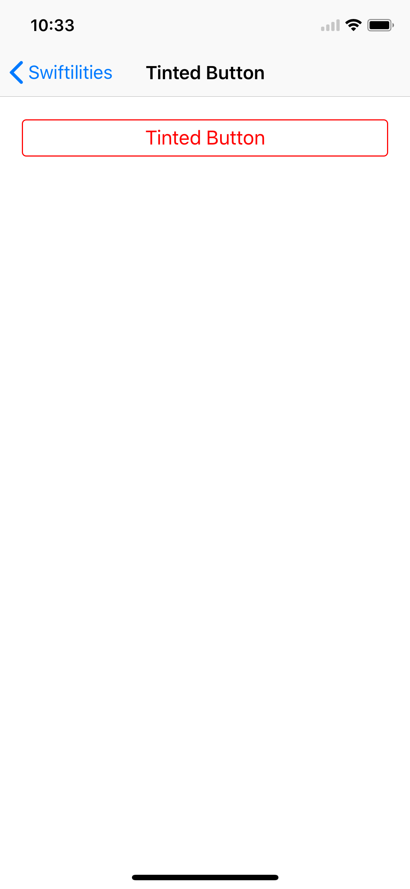
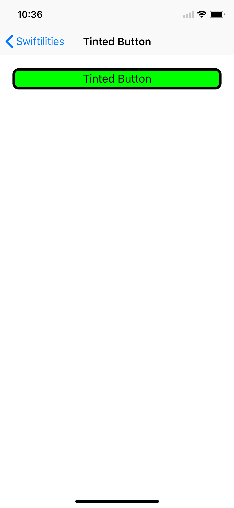

# TintedButton

A UIButton with a border and default color behavior

## Default Appearance

<details>
<summary>Screenshots</summary>



</details>

### Quick Start

A TintedButton with default border width and corner radius. The fill and text colors will be swapped when the button is highlighted (the border will continue to use textColor).
```swift
let tintedButton = TintedButton(fillColor: .white, textColor: .red)
tintedButton.setTitle("Tinted Button", for: .normal)
view.addSubview(tintedButton)
tintedButton.translatesAutoresizingMaskIntoConstraints = false
let guide = view.safeAreaLayoutGuide
tintedButton.bottomAnchor.constraint(equalTo: guide.topAnchor, constant: 20).isActive = true
tintedButton.widthAnchor.constraint(equalTo: guide.widthAnchor, constant: -40).isActive = true
tintedButton.centerXAnchor.constraint(equalTo: guide.centerXAnchor).isActive = true
```

## Custom Appearance

<details>
<summary>Screenshots</summary>



</details>

A custom border width and corner radius may also be supplied.

```swift
let tintedButton = TintedButton(fillColor: .green, textColor: .black, buttonCornerRadius: 10.0, buttonBorderWidth: 4.0)
tintedButton.setTitle("Tinted Button", for: .normal)
view.addSubview(tintedButton)
tintedButton.translatesAutoresizingMaskIntoConstraints = false
let guide = view.safeAreaLayoutGuide
tintedButton.bottomAnchor.constraint(equalTo: guide.topAnchor, constant: 20).isActive = true
tintedButton.widthAnchor.constraint(equalTo: guide.widthAnchor, constant: -40).isActive = true
tintedButton.centerXAnchor.constraint(equalTo: guide.centerXAnchor).isActive = true
```
