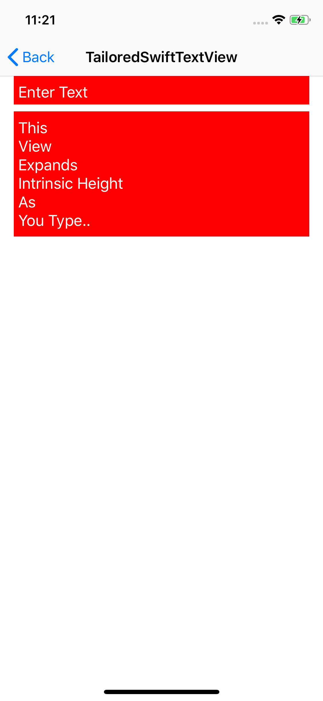

# PlaceholderTextView

A UITextView that can show placeholder text when empty

## Default Appearance

<details>
<summary>Screenshots</summary>


</details>

### Quick Start

A simple TextView with placeholder text:
```swift
let aTextView = PlaceholderTextView(frame: CGRect(x: 0, y: 0, width: 200, height: 200))
aTextView.placeholder = "Type Here"
view.addSubview(aTextView)
aTextView.translatesAutoresizingMaskIntoConstraints = false
aTextView.leadingAnchor.constraint(equalTo: view.leadingAnchor).isActive = true
aTextView.topAnchor.constraint(equalTo: view.topAnchor).isActive = true
aTextView.widthAnchor.constraint(equalTo: view.widthAnchor).isActive = true
aTextView.heightAnchor.constraint(equalToConstant: 100.0).isActive = true
```
A text color can be assigned to `.placeholderTextColor`, or fully styled text can be assigned to the `.attributedPlaceholder` property.

# TailoredSwiftTextView

A PlaceholderTextView that resizes height to fit text entered

## Default Appearance

<details>
<summary>Screenshots</summary>



</details>

### Quick Start

A simple TextView with placeholder text:
```swift
let tailorTextView = TailoredSwiftTextView(frame: CGRect(x: 0, y: 0, width: 200, height: 200))
tailorTextView.backgroundColor = .red
tailorTextView.textColor = .white
tailorTextView.font = .systemFont(ofSize: 18)
view.addSubview(tailorTextView)
tailorTextView.translatesAutoresizingMaskIntoConstraints = false
tailorTextView.leadingAnchor.constraint(equalTo: view.leadingAnchor).isActive = true
tailorTextView.topAnchor.constraint(equalTo: aTextView.bottomAnchor, constant: 20).isActive = true
tailorTextView.widthAnchor.constraint(equalTo: view.widthAnchor).isActive = true
```
